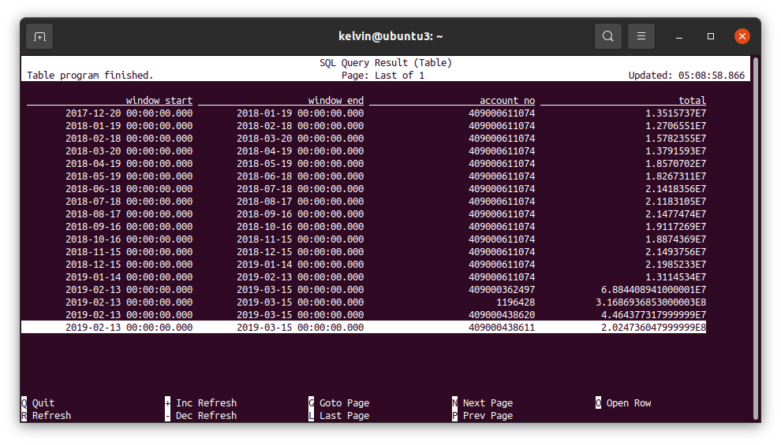

# Dejavu

Dejavu is a stack meant for [PyFlink](https://flink.apache.org/) quickstarts. It include Docker images to start a local development, together with automation scripts and some examples.

## Project Structure

- **docker**: Docker image for PyFlink and some related scripts for building and pushing
- **.devcontainer**: Configuration files for Dev Container for VS Code
- **app**: PyFlink examples with some sample data
- `VERSION` file: This file will be read throughout the automation scripts to determine which version of PyFlink we want to use (at the point of writing, we're using the latest 1.13.2)
- `docker-compose.yml`: Docker-compose file to bring up the development stack
- `Makefile`: A

## Installation

Before starting working on this project, the following pre-requisites are needed:

- [Docker](https://docs.docker.com/engine/install/ubuntu/)
- [Docker Compose](https://docs.docker.com/compose/install/)
- (Optional) Make via `sudo apt-get install make` - This is only meant for running tests and not needed at the moment.

> **NOTE**: The development stack is tested with Ubuntu 20.4 and MacOS X but since it is only dependent on Docker, it should work fine on Windows.

## Development

To start local development stack:

- Build the docker image with `./docker/build.sh`
- Bring up the containers with `docker-compose up --remove-orphans -d`
- (Optional) If you are using VS Code, the stack is also shipped with a `devcontainer.json` file so that you can attach VS Code to the `jobmanager` container with the mounted workspace to use it as a full-featured environment. [Read More](https://code.visualstudio.com/docs/remote/containers)

There are a few examples provided.

1. Example [`bank_stream_table_api.py`](./app/bank_stream_table_api.py)

```bash
docker-compose exec jobmanager ./bin/flink run -py /opt/app/bank_stream_table_api.py
```

Check the result in the output path and it should look something like below:

```bash
$ docker-compose exec taskmanager find /tmp/output
/tmp/output
/tmp/output/2021-08-31--04
/tmp/output/2021-08-31--04/.part-0-0.inprogress.47949645-ba93-40c7-a18e-d88ba1845cf2

$ docker-compose exec taskmanager cat /tmp/output/2021-08-31--04/.part-0-0.inprogress.47949645-ba93-40c7-a18e-d88ba1845cf2
+I[2017-12-20 00:00:00.0, 2018-01-19 00:00:00.0, 2018-01-18 23:59:59.999, 409000611074, 1.3515737E7]
+I[2018-01-19 00:00:00.0, 2018-02-18 00:00:00.0, 2018-02-17 23:59:59.999, 409000611074, 1.2706551E7]
+I[2018-02-18 00:00:00.0, 2018-03-20 00:00:00.0, 2018-03-19 23:59:59.999, 409000611074, 1.5782355E7]
```

2. Example [`bank_stream_sql.py`](./app/bank_stream_sql.py) does the same thing as [`bank_stream_table_api.py`](./app/bank_stream_table_api.py) but with SQL using Table API's `execute_sql`. To run the example:

```bash
docker-compose exec jobmanager ./bin/flink run -py /opt/app/bank_stream_sql.py
```

In this example, since we are using `.print()`, the output should look something like the below.

```
$ docker-compose exec jobmanager ./bin/flink run -py /opt/app/bank_stream_sql.py
Job has been submitted with JobID 3cdb1ad83553e88d788666f4f0dce83c
+----+-------------------------+-------------------------+--------------------------------+--------------------------------+
| op |            window_start |              window_end |                     account_no |                          total |
+----+-------------------------+-------------------------+--------------------------------+--------------------------------+
| +I | 2017-12-20 00:00:00.000 | 2018-01-19 00:00:00.000 |                   409000611074 |                    1.3515737E7 |
| +I | 2018-01-19 00:00:00.000 | 2018-02-18 00:00:00.000 |                   409000611074 |                    1.2706551E7 |
| +I | 2018-02-18 00:00:00.000 | 2018-03-20 00:00:00.000 |                   409000611074 |                    1.5782355E7 |
| +I | 2018-03-20 00:00:00.000 | 2018-04-19 00:00:00.000 |                   409000611074 |                    1.3791593E7 |
+----+-------------------------+-------------------------+--------------------------------+--------------------------------+
18 rows in set
```

3. To perform the same operation with SQL, we can bash into `jobmanager` with

```bash
docker exec -it jobmanager /bin/bash
```

and then spin up the SQL client that is shipped with Flink.

```bash
./bin/sql-client.sh
```

Refer to [`bank_stream_queries.sql`](./app/bank_stream_queries.sql) for the queries to run. The result should look like the below.



## Test

Test suites for this stack have not yet been developed (a PR is more than welcome 😄 ). The plan was to have PyFlink installed in a Python virtual env to run the tests locally on host. A `Makefile` has been scaffolded for this purpose.

## Deployment

There isn't deployment suite for this stack. Refer to [Ideas & Future Development](#ideas--future-development)

## Ideas & Future Development

- **Deployment**: Something like [Apache Ansible](https://docs.ansible.com/) would be great to have and is easy to set up. The expected result would be an automated deployment suite to deploy the stack to a cloud provider or a remote host.

- **More Examples** - Some ideas are:
  - Create `Kafka` container to quick start some interactions between `Flink` and `Kafka`
  - Demo functionalities of Python UDF and more examples with DataStream API
  - Perhaps extending the stack to a full-suite solution with databases and dashboards (with PostgreSQL, Apache Superset, etc.). This would couple nicely with the idea of deployment automation

**Have fun!** 🎉
